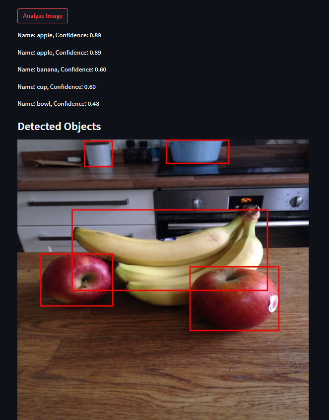
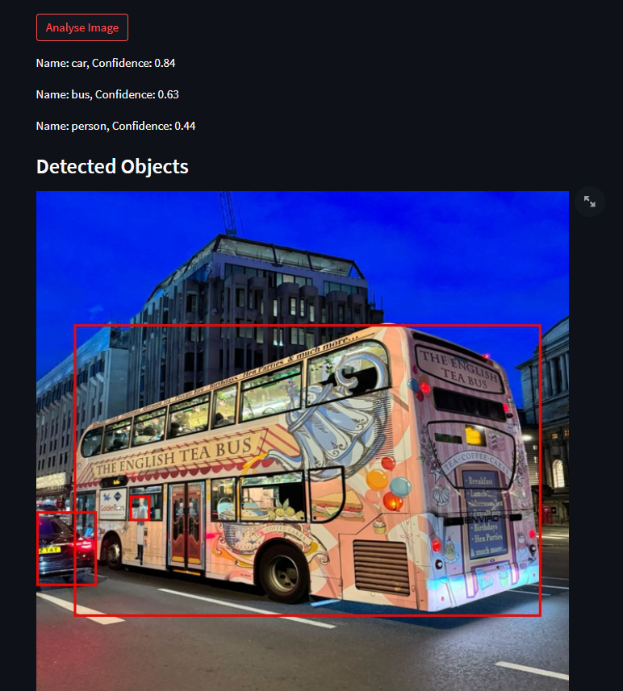

# Object Detection using YOLOv5 and Streamlit
This project is a Streamlit application that allows users to upload an image and perform object detection using YOLOv5. Upon uploading an image and clicking the "Analyse Image" button, the application will detect objects present in the image and display a list of their names.

## Features

- **Image Upload**: Users can upload an image file (JPEG, PNG, etc.) using a file uploader widget.
- **Object Detection**: Upon clicking the "Analyse Image" button, the application processes the uploaded image using YOLOv5.
- **Results Display**: Detected objects are listed with their corresponding names.

## Installation

To run this application locally, follow these steps:

1. Clone the repository: https://github.com/rewaaalaa7/object-detection-yolov5.git 
2. Install the required dependencies: pip install -r requirements.txt
Make sure you have Python installed on your system.

3. Run the Streamlit application: streamlit run app.py
4. Access the application in your web browser at `http://localhost:8501`.

## Usage

1. **Upload an Image**: Click on the "Browse files" button to select an image file from your computer.
2. **Analyse Image**: After uploading the image, click on the "Analyse Image" button to perform object detection.
3. **View Results**: Detected objects will be displayed as a list of component names below the image.

## Technologies Used

- Python
- YOLOv5
- Streamlit

## Contributing

Contributions are welcome! If you'd like to contribute:
- Fork the repository
- Create your feature branch (`git checkout -b feature/YourFeature`)
- Commit your changes (`git commit -am 'Add some feature'`)
- Push to the branch (`git push origin feature/YourFeature`)
- Create a new Pull Request

## License

This project is licensed under the MIT License - see the LICENSE file for details.

## Acknowledgements

- YOLOv5: [ultralytics/yolov5](https://github.com/ultralytics/yolov5)
- Streamlit: [streamlit.io](https://streamlit.io)

## Contact

For any questions or feedback, feel free to reach out at rewaawaad@gmail.com
